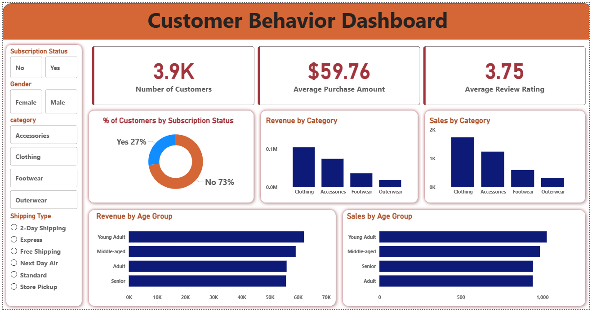

# Customer Shopping Behavior Analysis
## Project Overview
This project analyzes customer shopping behavior using transactional retail data. The objective is to identify purchasing patterns, customer preferences, spending habits, and business opportunities through data analysis and visualization.

The project uses Python for data cleaning and exploratory data analysis, PostgreSQL for SQL-based analysis, and Power BI for dashboard creation.

---
## Dataset Information
- Total Records: 3,900
- Features: 18
- Data Type: Customer Shopping Transactions

### Key Columns
- Customer ID
- Age
- Gender
- Category
- Purchase Amount
- Review Rating
- Subscription Status
- Shipping Type

---
## Tools & Technologies
- Python
- Pandas
- NumPy
- PostgreSQL
- SQL
- Power BI
- Jupyter Notebook

---
## Project Workflow
### Data Cleaning
- Handled missing values
- Standardized column names
- Removed redundant columns

### Exploratory Data Analysis
- Customer demographics analysis
- Revenue analysis
- Product category analysis
- Subscription analysis

### SQL Analysis
- Revenue by gender
- Subscriber vs non-subscriber analysis
- High-spending customer identification

### Dashboard Creation
- Interactive Power BI dashboard
- KPI tracking
- Category-wise revenue analysis
- Customer segmentation

---
## Key Insights
- Clothing category generated the highest revenue.
- Young adults contributed the highest sales volume.
- Male customers generated more revenue than female customers.
- Top-rated products included Gloves, Sandals, and Boots.
- Subscription adoption remains a growth opportunity.

## Dashboard Preview

---
## Project Structure
Customer-Shopping-Behavior-Analysis/
│
├── customer_shopping_behavior.csv
├── Customer_Behaviour_Analysis.ipynb
├── customer_behavior_analysis.sql
├── README.md
├── dashboard_screenshot.png

---
## Future Improvements

- Customer Segmentation
- Sales Forecasting
- Customer Churn Prediction
- Recommendation System

---
## Author
Shreya Kini
B.Tech in Artificial Intelligence & Machine Learning
Interested in Data Analytics, Business Intelligence, and Data Visualization.
Skills: SQL, Python, Power BI, Excel, PostgreSQL
